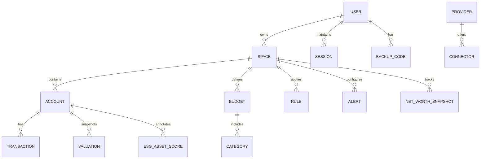

# MADFAM Budget & Wealth Tracker — Software Specification (v0.1)

**Project Codename:** Dhanam Ledger
**Owner:** Innovaciones MADFAM S.A.S. de C.V. (Aldo Ruiz Luna)
**Last Updated:** 2025-08-23
**Status:** Draft for review (P0 locked; P1 noted)

---

## 0) Mission & Outcomes

**Mission:** Unify personal + business budgeting and wealth tracking with ESG insight, so LATAM-first founders make cleaner, smarter money decisions.

**MVP Success (first 90 days):**

* 300 signups / 120 WAU
* ≥60% connect ≥1 bank/crypto account
* Live in MX/US/EU (MXN, USD, EUR)

**Primary Users (ranked):** Solo founder/SMB owner → Freelancer → Individual

---

## 1) Scope (P0 vs P1)

**P0 (MVP must-have):**

* Spaces: Personal & Business (up to 3 business spaces)
* Connections: Belvo (MX), Plaid (US), Bitso + 1 non-custodial wallet (ETH/BTC/xPub)
* Read-only financial data (balances, txns); no money movement
* Budgeting: monthly category caps; rules-based auto-categorization; 60-day cashflow forecast (weekly)
* Wealth tracking: net worth (assets − liabilities), allocation by asset class & currency
* ESG: crypto asset ESG composite + basic environmental metric; methodology page
* Auth & security: email+password, TOTP 2FA, JWT + rotating refresh; backup codes
* Localization: EN & ES; default ES in MX, EN elsewhere
* Analytics: PostHog events baseline
* Admin basics: user search, read-only impersonation, feature flags, audit logs

**P1 (strongly recommended next):**

* Accountant/Advisor seat (viewer/editor per Space)
* SAT/CFDI ingestion (read-only) for MX
* Alerts expansion (low balance, ESG flags), receipt OCR, envelopes, ML categorization
* EU data region, equities/ETF ESG, simple rebalancing suggestions

**Out of Scope (MVP):** money movement, tax filing, payroll, invoicing, full bookkeeping automation, equities ESG, ML auto-categorization, receipt OCR.

---

## 2) Personas & Jobs-to-be-Done

**Aldo Solo-Founder** — runs 1–2 entities; pain: mixed personal/business; wants cashflow clarity; needs unified dashboard and simple budgets.

**Freelancer Fernanda** — irregular income; needs category caps, tax set-aside visibility, and quick rules to keep books tidy.

**Ops-Mindful Ivan** — cares about net worth and ESG overlay; wants crypto + fiat view with minimal effort.

**Top JTBD (ranked):** connect accounts → auto-categorize & budget vs actual → track net worth across fiat/crypto → see cash runway/forecast → ESG overlay.

---

## 3) User Experience

**Primary Flows:**

1. **Onboarding** → create account → choose default currency & region → create Spaces (Personal, Business-1) → connect Belvo/Plaid/Bitso or add wallet → import 90 days → set base budget.
2. **Budget Setup** → pick base categories → set monthly caps → define simple rules ("merchant contains X → category Y").
3. **Transactions** → view unified feed per Space → bulk categorize → mark recurring → split transactions → notes & attachments (meta only; OCR P1).
4. **Wealth Dashboard** → balances by account & class → net-worth trend → allocation by currency → ESG scores for crypto.
5. **ESG Insight** → per-asset ESG composite with expandable E/S/G subs + methodology link.
6. **Alerts** (MVP): budget overspend, bill due, large transaction.

**Navigation Skeleton:** Home (Overview) · Transactions · Budget · Wealth · ESG · Settings (Space, Connectors, Alerts, Security) · Admin (staff only)

**Accessibility:** Aim WCAG 2.1 AA; keyboard navigable; color-contrast checks.

---

## 4) Feature Specs & Acceptance Criteria (P0)

### 4.1 Authentication & Sessions

* Email/password with strength checks (min length, complexity).
* TOTP 2FA (authenticator apps), QR setup, backup codes.
* Sessions: short-lived JWT + rotating refresh tokens.

**Acceptance:**

* Can enroll TOTP, generate QR, confirm with 6-digit code.
* Backup codes generated (10) and downloadable once.
* Refresh token rotates on each use, previous invalidated.

### 4.2 Spaces & Access

* Spaces: Personal (1) + Business (≤3); each Space has its own accounts, budgets, categories.
* P1: shared access roles (Owner, Editor, Viewer) per Space.

**Acceptance:**

* User can create, rename, archive Spaces; cannot exceed limits.
* Switching Space switches data scope across all pages.

### 4.3 Connections & Data Sync (Read-only)

* Providers: Belvo (MX), Plaid (US), Bitso (crypto), Non-custodial ETH/BTC/xPub.
* Fetch: accounts, balances, transactions (90 days min).
* Webhooks to update on changes; manual refresh.

**Acceptance:**

* Connect via provider flow; see balances within 60s; min 90 days transactions imported.
* Manual refresh updates deltas; webhook events update within 5 min.

### 4.4 Budgeting

* Monthly category caps; base taxonomy with custom categories.
* Rules engine (merchant/description contains → category).
* Recurring flag & projections.
* Forecast: 60-day cashflow (weekly) using recurrences + historical averages.

**Acceptance:**

* Create/edit/delete categories; set caps per month.
* Create/edit rules; auto-apply on new imports; batch re-run rules.
* Forecast renders without >1.5s p95 on typical dataset (≤10k txns).

### 4.5 Transactions

* Unified feed with filters (date, account, category, amount range, search).
* Bulk categorize; split transactions; notes; attach receipt metadata (file ref only, no OCR).

**Acceptance:**

* Can split a transaction into ≥2 lines with categories; totals reconcile.
* Bulk operations on ≥100 txns complete <2s p95.

### 4.6 Wealth Tracking & KPIs

* Net worth = sum(assets) − sum(liabilities).
* Views: by asset class, by currency; trend over time.
* Snapshots daily for connected accounts; manual assets user-updated.

**Acceptance:**

* Net-worth trend shows daily points for last 90 days.
* Allocation chart matches underlying account balances within rounding.

### 4.7 ESG (Crypto)

* Display composite ESG score per crypto asset + basic environmental metric (e.g., estimated energy intensity) using Dhanam logic.
* ESG methodology page linked from asset details.

**Acceptance:**

* Each held crypto shows ESG score & at least one metric; methodology renders.

### 4.8 Alerts (MVP)

* Budget overspend, bill due (from recurring), large transaction (threshold configurable).

**Acceptance:**

* Users can enable/disable per Space; receive in-app + email; deduplicated per day.

### 4.9 Localization

* English & Spanish UI; default ES in MX region, EN elsewhere.
* Currency formats for MXN/USD/EUR; Banxico FX for MXN↔USD/EUR.

**Acceptance:**

* Users can switch language; formats update; FX conversions use daily Banxico rate.

### 4.10 Admin & Support

* Admin: user search, read-only impersonation, feature flags, audit logs.
* Support: in-app email/chat (provider TBD), 1-business-day SLA; public status page.

**Acceptance:**

* Staff can impersonate read-only with audit trail; feature flags toggle per user/Space.

---

## 5) Non-Functional Requirements

* **Performance:** p95 page load <1.5s; manual refresh <15s; background sync hourly.
* **Availability:** 99.9%; backups daily; RPO 24h; RTO 4h.
* **Observability:** OpenTelemetry traces; structured logs; metrics dashboards; error budgets per service.
* **Security:** TLS 1.2+; AES-256 at rest with KMS; least-privilege IAM; secrets in AWS Secrets Manager.
* **Privacy & Compliance:** LFPDPPP (MX), GDPR readiness, CCPA awareness; PII minimization (email, region, currency, language; name optional).
* **Data Residency:** Primary AWS us-east-1; EU isolation in Phase 2.

---

## 6) System Architecture

**Stack:**

* Web: Next.js (React)
* Mobile: React Native + Expo
* Backend: Node + NestJS (Fastify)
* DB: Postgres (primary), Redis (cache/queues)
* Infra: AWS ECS/Fargate; Terraform; containerized
* Queues: BullMQ on Redis; aggregator webhooks
* Analytics: PostHog
* ESG Service: Dhanam (as shared lib/service)

**Component Diagram (mermaid):**

```mermaid
flowchart LR
  A[Web App (Next.js)] -->|REST+JWT| B[NestJS API]
  M[Mobile App (RN/Expo)] -->|REST+JWT| B
  B -->|SQL| D[(Postgres)]
  B -->|cache/queues| R[(Redis)]
  B <-->|OAuth/Link| C[Belvo/Plaid]
  B <-->|API| X[Bitso/Coinbase/Binance]
  B <-->|pkg/API| E[Dhanam ESG Service]
  C <--> W[Provider Webhooks]
  W --> B
```

**Data Flow Highlights:**

1. Client requests link token → provider connect flow → access tokens stored encrypted.
2. API syncs accounts/txns; normalizes & categorizes; schedules jobs via BullMQ.
3. Daily snapshots & ESG scores computed; net-worth series updated.

---

## 7) Data Model (ERD excerpt)



**Key Tables (P0):**

* `users` (id, email, password\_hash, locale, region, currency, created\_at)
* `sessions` (id, user\_id, jwt\_id, refresh\_token\_hash, expires\_at)
* `backup_codes` (id, user\_id, code\_hash, used\_at)
* `spaces` (id, user\_id, type: personal|business, name, status)
* `connectors` (id, space\_id, provider, access\_token\_enc, institution\_id, status, last\_sync\_at)
* `accounts` (id, space\_id, connector\_id, type, name, currency, balance, mask, external\_id)
* `transactions` (id, account\_id, posted\_at, amount, currency, description, merchant, category\_id, is\_recurring, split\_parent\_id, metadata)
* `categories` (id, space\_id, name, type: income|expense, parent\_id, is\_base)
* `budgets` (id, space\_id, month, category\_id, cap\_amount, currency)
* `rules` (id, space\_id, match\_type, match\_value, category\_id, active)
* `valuations` (id, account\_id, as\_of, balance, currency, fx\_rate)
* `net_worth_snapshots` (id, space\_id, as\_of, total\_assets, total\_liabilities, currency)
* `esg_asset_scores` (id, account\_id|asset\_symbol, composite, e, s, g, metric\_key, metric\_value, source)
* `alerts` (id, space\_id, type, threshold, channel, enabled)
* `audit_logs` (id, actor\_id, space\_id, action, target, metadata, created\_at)

---

## 8) APIs (REST + OpenAPI)

**Auth**

* `POST /auth/register` — email, password, locale, region
* `POST /auth/login` — email, password
* `POST /auth/totp/setup` — returns QR secret
* `POST /auth/totp/verify` — confirm TOTP
* `POST /auth/token/refresh` — rotate refresh

**Spaces**

* `GET/POST /spaces` — list/create
* `PATCH /spaces/:id` — rename/archive

**Connectors**

* `POST /connectors/:provider/link_token` — init flow
* `POST /connectors/:provider/exchange_public_token`
* `GET /connectors` — list; `DELETE /connectors/:id`
* `POST /webhooks/:provider` — receive provider webhooks

**Accounts & Transactions**

* `GET /accounts` / `GET /accounts/:id`
* `POST /accounts/:id/refresh`
* `GET /transactions` (filters)
* `POST /transactions/bulk` — categorize/split

**Budgeting**

* `GET/POST /categories`
* `GET/POST /budgets`
* `GET/POST /rules` ; `POST /rules/reapply`

**Wealth & ESG**

* `GET /net-worth/snapshots`
* `GET /allocations` (by class/currency)
* `GET /esg/scores?asset=`

**Admin** (staff only)

* `GET /admin/users` ; `POST /admin/impersonate/:userId` (read-only)
* `GET/POST /admin/feature-flags`
* `GET /admin/audit`

**Errors:** JSON problem details; request-id in header; rate limits via headers.

---

## 9) Security & Privacy

* Password hashing (Argon2id recommended), password policy with breach check.
* 2FA TOTP required for admin, optional for users with gentle nudge; enforced on sensitive ops (connector changes, data export).
* Token design: short-lived access JWT (≤15m), rotating refresh (≤30d) with revoke list (Redis).
* Secrets: AWS KMS, Secrets Manager; provider tokens encrypted at rest.
* Ratelimiting & IP throttling per endpoint; suspicious login alerts.
* Data minimization; export & delete (right-to-be-forgotten) flows.
* Audit logs for all admin & security-sensitive actions.

**Threats & Mitigations:**

* Aggregator outages → graceful degradation + retry/backoff + status banner.
* Webhook spoofing → HMAC verification per provider.
* PII leakage → scoped fields, encryption, access audits.
* XSS/CSRF → JWT in Authorization header (no cookies); strict content security policy.

---

## 10) ESG Integration (Dhanam)

* Use Dhanam shared package/service for crypto ESG composite + environmental metric.
* Display composite plus optional E/S/G subs; link to **ESG Methodology** page explaining sources & caveats.
* Future: equities/ETF ESG via provider adapters.

**Methodology Page (MVP contents):** scope (crypto), definitions (E/S/G), data sources, update cadence, limitations, disclaimer.

---

## 11) Localization & FX

* i18n library with message catalogs for EN/ES.
* Number/date/currency formatting per locale; default ES (MX), EN elsewhere.
* Banxico FX for MXN↔USD/EUR daily rates; store rate used per valuation.

---

## 12) Observability & Ops

* Centralized logs with request-id correlation; metrics (latency, error rate, job queue depth, sync success/fail).
* Tracing across web → API → external providers.
* Healthchecks (`/health`, `/ready`) for ECS.
* Feature flags for gradual rollout (per user/Space/provider).
* Incident playbooks; public status page.

---

## 13) Admin & Support

* Admin console: user search, read-only impersonation with banner; feature flags; audit views.
* Support: in-app email/chat integration; canned replies for common connector issues; SLA 1 business day.

---

## 14) Analytics & Metrics

**Product Events (PostHog):** sign\_up, onboarding\_complete, connect\_initiated, connect\_success, sync\_success, sync\_fail, budget\_created, rule\_created, txn\_categorized, alert\_fired, view\_net\_worth, export\_data.

**Business KPIs (MVP):** WAU/MAU, D1/D7 retention, connected accounts/user, % with active budgets, users with net-worth tracking, churn reasons.

---

## 15) Roadmap & Milestones

**Cutline for MVP (P0 only):** connections (Belvo/Plaid/Bitso + wallet), budgets & rules, net worth & allocations, crypto ESG + methodology, alerts (3), EN/ES, admin basics, analytics, Banxico FX.

**vNext (first 90 days):** envelopes; ML categorization; receipt OCR; accountant seat; EU data region; equities ESG; rebalancing suggestions; SAT/CFDI ingestion; low-balance/ESG alerts.

**Release Plan:**

* **Alpha (internal + 20 users):** core flows; stability over breadth.
* **Beta (50–80 users; MX founders/freelancers + few US/EU):** polish & telemetry-driven fixes.
* **GA:** pricing on; support playbooks ready.

**Sign-offs:** Product (Aldo), Security (Aldo + advisor), Legal/Privacy (external counsel).

---

## 16) Testing & QA

* Unit & integration tests for auth, rules, sync adapters; contract tests for provider webhooks; snapshot tests for ESG outputs.
* Synthetic monitors for provider flows.
* Seeded demo Space for manual QA.

**Acceptance Test Examples:**

* Connect Belvo institution; balances visible ≤60s; 90-day txn history present.
* Create rule `"contains: UBER" → Transport`; new UBER txns auto-categorized.
* Change language to ES; dates/currency/localization update across app.
* Enable large-transaction alert at \$500; simulate import → alert triggers once/day.

---

## 17) Open Questions (to confirm or defer)

1. Passkeys/WebAuthn in MVP or P1?
2. Which provider for in-app support (Intercom vs Zendesk)?
3. Minimum OS versions (iOS/Android) for RN/Expo?
4. Manual asset classes to include by default (Real Estate, Vehicles, PE)?
5. Data export format (CSV + JSON) scope in MVP?

---

## 18) References

* Dhanam (ESG/auth baseline): `https://github.com/aldoruizluna/Dhanam`
* Banxico FX: official daily rates (integration TBD)

---

## 19) Appendix — Category Base List (Draft)

**Personal:** Housing, Utilities, Groceries, Dining, Transport, Health, Subscriptions, Education, Entertainment, Savings/Investments, Taxes, Misc.
**Business:** Revenue, Cost of Goods Sold, Payroll, Contractor, Software/SaaS, Marketing, Travel, Office, Utilities, Taxes, Fees, Misc.

---

### End of Spec v0.1
